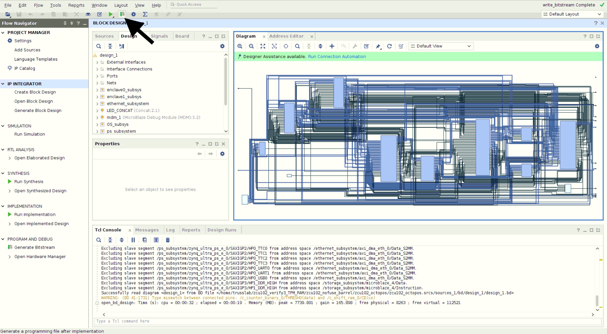

# Populating Hardware Design and Launching OctopOS Software

Software Version: Vivado 2020.1
Hardware Version: ZCU102

This document provides a step-by-step guide to populate our hardware design and to launch OctopOS software on top of it.
It is recommended to follow this guide on a single Linux machine with at least 32GB of RAM and 512GB of free disk space (SSD is preferred), although it is possible to prepare hardware design, OctopOS binaries, and petalinux image separately on different machines.
We use a Intel Xeon E5-2697 CPU with 72 threads with 192 GB memory to prepare the hardware design and OctopOS binaries. The total machine time is about 8 hours, and the manual work takes about 12 hours if you are familiar with the tools.

## Hardware Design

1) Clone this repo (`git clone https://github.com/trusslab/octopos_hardware`) into `<PATH_TO_OCTOPOS_HARDWARE>`. This repo contains the hardware design of our multi-domain hardware prototype, IP source codes, and scripts to populate the hardware design and launch OctopOS software.

2) To re-create the hardware project, install Vivado 2020.1, and run `vivado -source <PATH_TO_OCTOPOS_HARDWARE>/octopos_hw_zcu102/project_zcu102.tcl`.

3) Re-create the mailbox projects in the same way, package them, and add their paths to the IP repository of the main project. You may follow the instruction in our `guide to update Mailbox IP <https://github.com/trusslab/octopos_hardware/blob/main/docs/Update-Mailbox-IP.rst>`_ to do so.

4) Generate bitstream. This may take a few hours depending on your machine.

5) The synthesized hardware design is a `xsa` file. To export the hardware design to the Vitis SDK, click `File -> Export -> Export Hardware`. Selected `Fixed` and `Include bitstream`. Take note of the file location of the exported `xsa` file.

## OctopOS Software

6) Launch Vitis, and load the exported `xsa`` file in step 5. The version of Vitis SDK should be 2020.1. Vitis SDK provides a GUI to manage the software running on each processor. 

7) Obtain the OctopOS software, `git clone https://github.com/trusslab/octopos` into `<PATH_TO_OCTOPOS_SOFTWARE>`. OctopOS is an operating system that runs on our multi-domain hardware. It provides source code to run on each domain, and a set of APIs to communicate between domains through our mailboxes. OctopOS supports both the hardware prototype (this repo), and a software emulator that runs on a Linux desktop (please see OctopOS repo for details). In this guide, we will use the hardware prototype.

8) mkdir `~/vitis_workspace`.

9) Create a Vitis working directory at `~/vitis_workspace/octopos_domains`. This directory will contain the software for each domain. This path is just an example and you can choose any path you like, same for step 11.

10) Keep the previous Vitis working directory open, launch another Vitis, and load the exported `xsa` file in step 5. Please make sure to launch a new Vitis, not a new project in the same Vitis window.

11) Create a new Vitis working directory named `~/vitis_workspace/octopos_bootloaders`. This directory will contain the bootloaders for each domain.

12) Mount OctopOS software into the Vitis working directory for the domains, `source <PATH_TO_OCTOPOS_HARDWARE>/scripts/mount_octopos.sh <PATH_TO_OCTOPOS_SOFTWARE> ~/vitis_workspace/octopos_domains`.

13) Mount OctopOS bootloaders into the Vitis working directory for the bootloaders, `source <PATH_TO_OCTOPOS_HARDWARE>/scripts/mount_octopos.sh <PATH_TO_OCTOPOS_SOFTWARE> ~/vitis_workspace/octopos_bootloaders`.

14) Open the Vitis OctopOS domain working directory created in step 9 (`~/vitis_workspace/octopos_domains`), create the following projects one by one (`File->New->Application Project`): `storage, oss, keyboard, serialout, enclave0, enclave1, network`. Please use the exact name for each domain project, and select the corresponding processors (all processor names starts with a domain name, so that you can easily  match them). Use default settings for all projects. Select `empty c project` for all domains except for `storage`. For `storage`, select `empty c++ project`.

15) Open the Vitis OctopOS bootloaders working directory created in step 11 (`~/vitis_workspace/octopos_bootloaders`), create the following projects one by one: `storage_bootloader, os_bootloader, keyboard_bootloader, serialout_bootloader, enclave0_bootloader, enclave1_bootloader, network_bootloader`. Please follow the same instructions as in step 14.

16) Apply patches to Xilinx BSPs, `source <PATH_TO_OCTOPOS_HARDWARE>/scripts/vitis_setup.sh ~/vitis_workspace/octopos_bootloaders ~/vitis_workspace/octopos_domains`.

17) Open the Vitis OctopOS domain working directory (`~/vitis_workspace/octopos_domains`). Repeat the following step for each domain projects: double-click the `<domain name>_system`, a subfolder named `<domain name>` will show up; right click the `<domain name>` folder, select `C/C++ Build Settings`, and navigate to `Microblaze gcc compiler->Symbols`, add the corresponding symbols in the table below for each project; navigate to `Microblaze gcc compiler->Optimization`, select `Optimize for size -Os`; navigate to `Microblaze gcc compiler->Inferred Options->Software Platform`, add `${workspace_loc:/${ProjName}/src/octopos/arch/include}` and `${workspace_loc:/${ProjName}/src/octopos/include}` to the include path. If the add button is not visible, drag the edge of the window to the right to make it visible. 

| Domain   | Compiler Symbol                                       |
|----------|-------------------------------------------------------|
| Storage  | ARCH_SEC_HW PROJ_CPP ARCH_SEC_HW_STORAGE               |
| OS       | ARCH_SEC_HW ARCH_SEC_HW_OS ROLE_OS                     |
| Keyboard | ARCH_SEC_HW_KEYBOARD                                  |
| Serialout| ARCH_SEC_HW_SERIAL_OUT                                 |
| Enclave0 | RUNTIME_ID=1 ARCH_SEC_HW ARCH_SEC_HW_RUNTIME           |
| Enclave1 | RUNTIME_ID=2 ARCH_SEC_HW ARCH_SEC_HW_RUNTIME           |
| Network  | ARCH_SEC_HW ARCH_SEC_HW_NETWORK HW_MAILBOX_BLOCKING   |

18) Open the Vitis OctopOS bootloader working directory (`~/vitis_workspace/octopos_bootloaders`). Repeat the same step as in step 17 for each bootloader projects (but use the table below for compiler symbols.

| Domain Name         | Compiler Symbol                                            |
|---------------------|------------------------------------------------------------|
| Storage Bootloader  | ARCH_SEC_HW_BOOT ARCH_SEC_HW PROJ_CPP ARCH_SEC_HW_BOOT_STORAGE ARCH_SEC_HW_STORAGE |
| OS Bootloader       | ARCH_SEC_HW ARCH_SEC_HW_OS ARCH_SEC_HW_BOOT ARCH_SEC_HW_BOOT_OS |
| Keyboard Bootloader | ARCH_SEC_HW ARCH_SEC_HW_KEYBOARD ARCH_SEC_HW_BOOT ARCH_SEC_HW_BOOT_KEYBOARD ARCH_SEC_HW_BOOT_OTHER |
| Serialout Bootloader| ARCH_SEC_HW ARCH_SEC_HW_SERIAL_OUT ARCH_SEC_HW_BOOT ARCH_SEC_HW_BOOT_SERIAL_OUT ARCH_SEC_HW_BOOT_OTHER |
| Enclave0 Bootloader | ARCH_SEC_HW ARCH_SEC_HW_RUNTIME ARCH_SEC_HW_BOOT ARCH_SEC_HW_BOOT_RUNTIME_1 ARCH_SEC_HW_BOOT_OTHER RUNTIME_ID=1 |
| Enclave1 Bootloader | ARCH_SEC_HW ARCH_SEC_HW_RUNTIME ARCH_SEC_HW_BOOT ARCH_SEC_HW_BOOT_RUNTIME_2 ARCH_SEC_HW_BOOT_OTHER RUNTIME_ID=2 |
| Network Bootloader   | ARCH_SEC_HW ARCH_SEC_HW_NETWORK ARCH_SEC_HW_BOOT ARCH_SEC_HW_BOOT_OTHER ARCH_SEC_HW_BOOT_NETWORK |

1)  Open the Vitis OctopOS domain working directory (`~/vitis_workspace/octopos_domains`). Build all projects. The first build will take about 10 minutes.

2)  Open the Vitis OctopOS bootloader working directory (`~/vitis_workspace/octopos_bootloaders`). Build all projects.

3)  Launch a new Vitis, and import the Vitis TPM project (`<PATH_TO_OCTOPOS_HARDWARE>/bin/vitis_tpm.zip`) to `~/vitis_workspace/octopos_tpm_forwarder`. Open the Vitis TPM project, and build it.

## Petalinux for the untrusted domain

22) Create the petalinux project for the untrusted domain.

## Package the final boot image

23) Open `<PATH_TO_OCTOPOS_HARDWARE>/scripts/set_path.sh`.

Change the `VITIS_INSTALLATION` variable to the installation path of Vitis, for example, `/opt/Xilinx/Vitis`. 

Change the `PETALINUX_PRODUCTS` variable to the path of the untrusted domain petalinux build. 

Change the `HW_DESIGN_WITH_ARBITTER` variable to the folder containing the exported hardware `xsa` file (in step 5). 

Change `VITIS_BOOTLOADERS` variable to `~/vitis_workspace/octopos_bootloaders`, and `VITIS_DOMAINS` to `~/vitis_workspace/octopos_domains`. 

Change the `VITIS_TPM` variable to `~/vitis_workspace/octopos_tpm_forwarder` created in step 21. 

Change the `OCTOPOS_DIR` variable to `<PATH_TO_OCTOPOS_SOFTWARE>`. 

Finally, set `BOOT_MEDIA` to the path to a mounted SD-Card. 

## Boot the external TPM device

24) Launch TPM on the untrusted domain.

## Prepare serial terminals

25) Plug the following pins and jumpers on the ZCU102 board:

| Pin | Connect to |
|-----|------------|
| xx  | xx         |
| xx  | xx         |
| xx  | xx         |
| xx  | xx         |

26) Open serial terminals for the following devices:

## Boot the ZCU102 board

27) Insert the SD-Card into the ZCU102 board, and power on the board.
