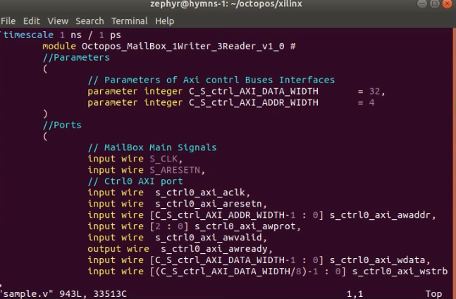
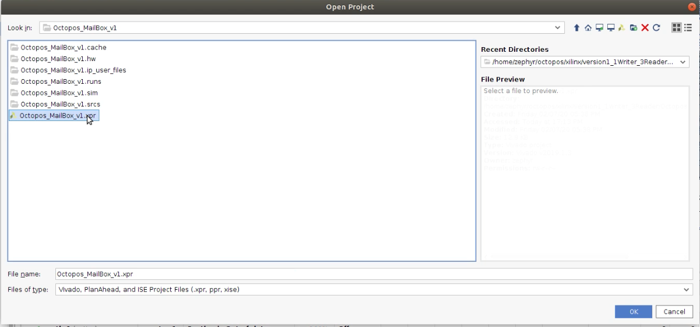
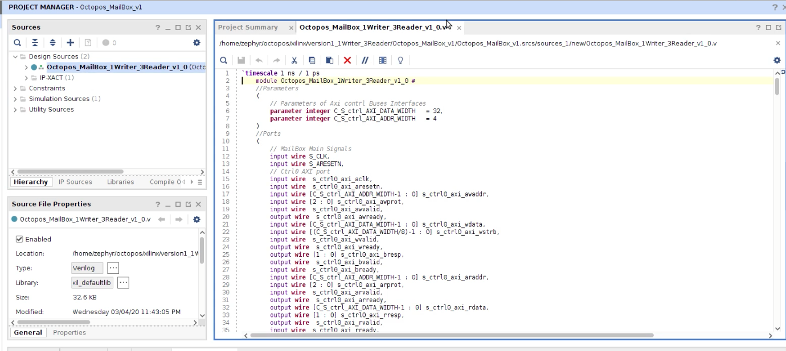
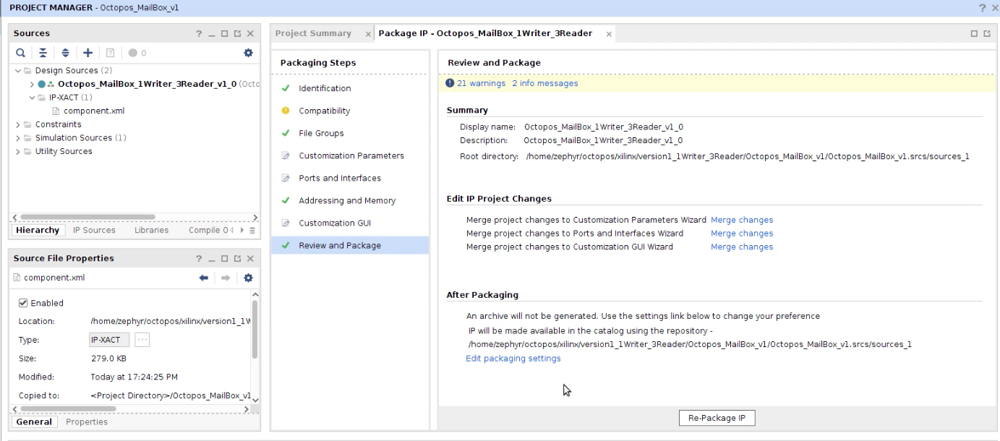
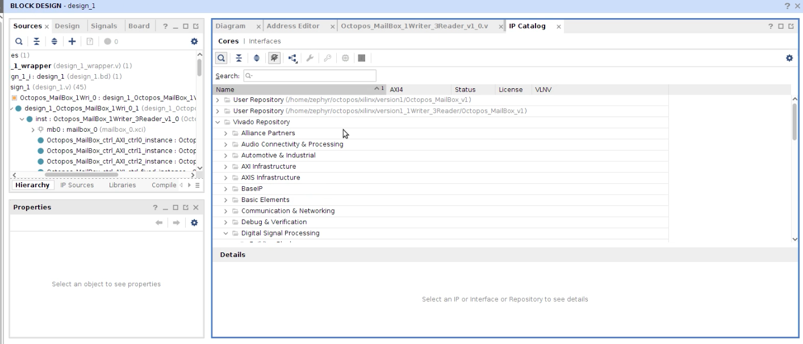
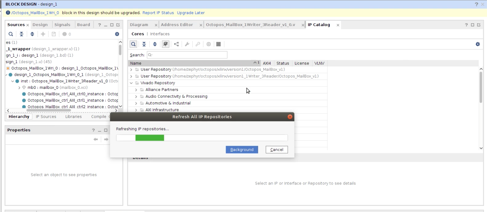
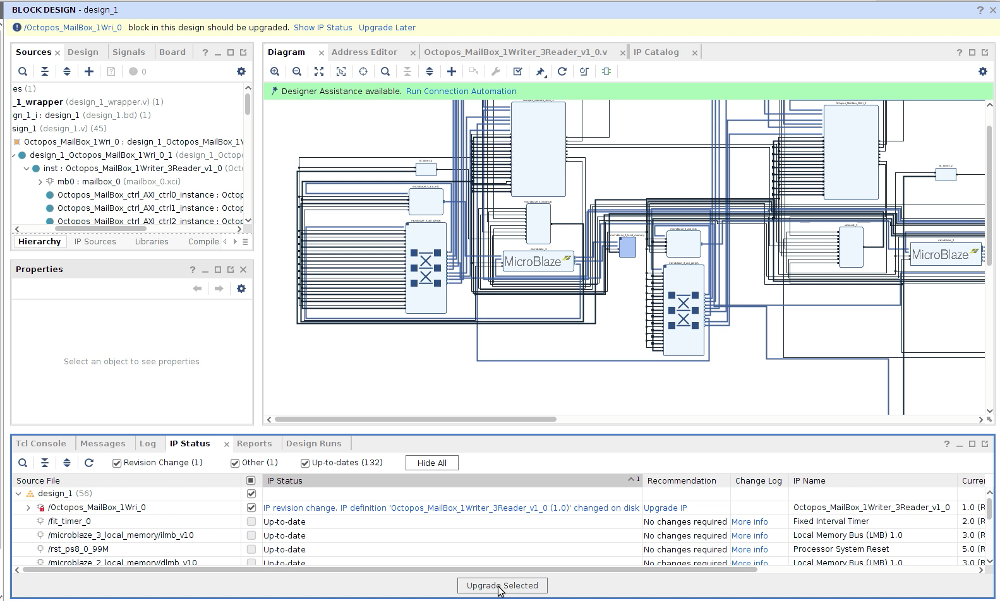
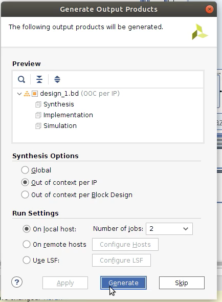

=========================
Update OctopOS Mailbox IP
=========================

Software Version: Vivado 2019.1.3

Step 1: Generate Mailbox Verilog code
-------------------------------------

Because all OctopOS data lines are single directional, there are two types of OctopOS Mailboxes defined for each direction: Single-Writer-Multiple-Readers Mailbox (SWMR), and Multiple-Readers-Single-Writer Mailbox (MRSW). The SWMR is commonly used in case of the fixed side is a writer, for example, a keyboard. The MRSW is commonly used for output devices, for example, a serial terminal. When a device (e.g., storage) requires both input and output data flows, mailboxes from each type is needed. 

`generate_code_for_MailBox.py` generate Verilog code for both types of OctopOS Mailboxes. To switch mode, toggle `manyWriter_OneReader` variable in the python script. `0` means SWMR mode, and `1` means MRSW mode.

* Run `python generate_code_for_MailBox.py`, and a `script.v` file will be generated in the current path. Open the file, and confirm the module name matches your purpose. The module name will be in form of `Octopos_MailBox_XWriter_CReader_<version number> `.

Step 2: Update the Mailbox project
----------------------------------

* Launch Vivado, and open the existing Mailbox project. 

* Under `Block Design` -> `Sources`->`Design Sources` , double click the module name, which is in form of `Octopos_MailBox_XWriter_CReader_<version number> `. 

* Replace the Verilog code with the code generated in Step 1.

* Under `Block Design` -> `Sources`->`Design Sources` , double click `IP-XACT`. 

* (Optional) Under `Packaging Steps`, you can make necessary changes to IP name. If you have multiple Mailbox projects, make sure they all have different IP name. Otherwise the IP Catalog will have a name conflict.

* Under `Packaging Steps`, click `Review and Packages`, and then click `Re-Package IP`. Upon success, a message box will pop up.

Step 3: Update the main project Mailbox IP
------------------------------------------

* Open the mail project in Vivado.

* Find `Window` -> `IP Catalog` in the Menu bar.

* Locate the customized mailbox IP path under `Name`. Right click the `User Repository(s)` pending update, and select `Refresh Repository`

* Once the refresh is done, you should see a yellow message on the top of the Block Design window indicating `<IP module name> block in the design should be upgraded`. Click `Report IP Status`.

* The `IP Status` tab will pop up in the bottom. The outdated design components are automatically checked. Click the `Update Selected` button.

* Upon success, you will see a message box saying `IP Upgrade Success`.

* It will automatically ask you to re-generate output products. You can generate now or delay it. This will take a while.

