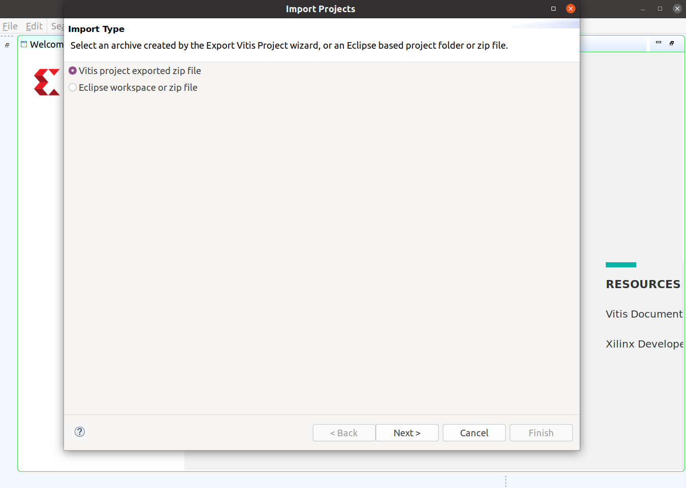

====================
Vitis Project Import
====================

Software Version: Vitis 2020.1

:Author: - Zephyr Yao (z.yao@uci.edu)

First, we need to create a new project in Vitis. Specify a new path (at your choice), click launch.

Next, click `File->Import->Vitis Project exported zip file` to import the project.

After the import, you can see the project in the `Explorer` window.