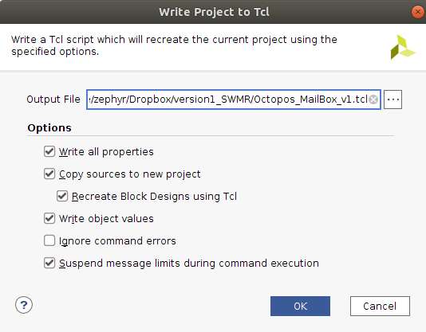

================================
hardware project version control
================================

Software Version: Vivado 2020.1

:Author: - Zephyr Yao (z.yao@uci.edu)

Create TCL file
---------------

To create a TCL file, go to the `File` menu and select `Write Project to Tcl`. This command will generate a TCL file, along with instructions to recreate the entire project. If you are using Git for version control, overwrite the previous TCL file by specifying the file location. Configure the options as follows:

Copy additional local files
---------------------------

Open the generated TCL file. The file specifies a list of source files that need to be manually copied to the Git repository.

Checklist
---------
Before committing to Git, please review this checklist to ensure that everything is up-to-date:

- [ ] a TCL file
- [ ] 2 TXT files (optional, for developer's reference)
- [ ] local files, as specified in the TCL file.
